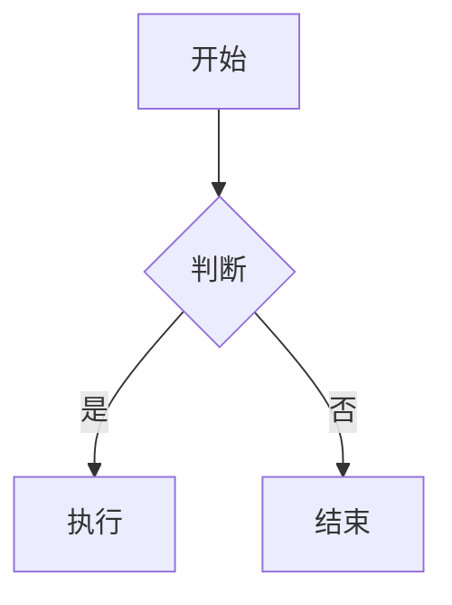
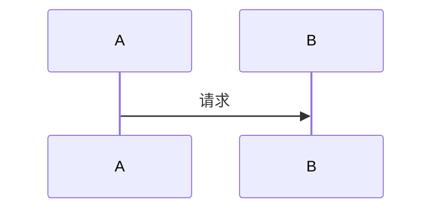
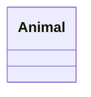
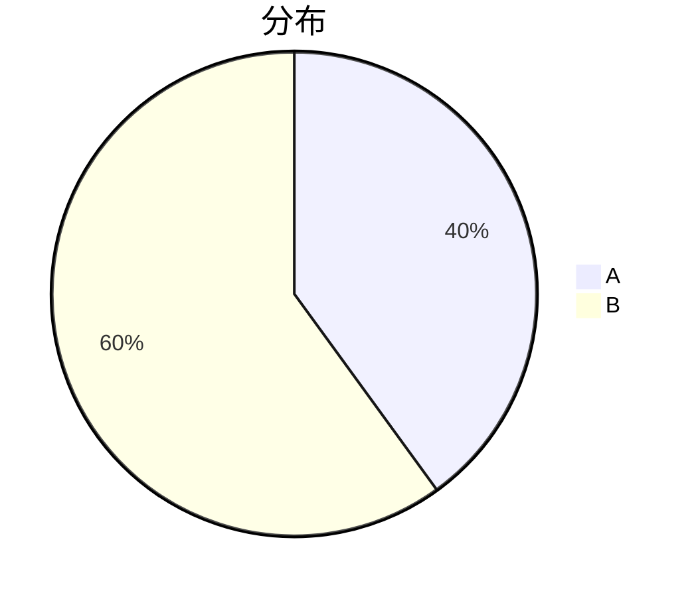

# HTML

HTML（超文本标记语言）通过成对的“标签”来描述页面结构。下面按用途分类列出常用标签。文中的标签（如 `<h1>`）都以行内代码形式书写，表示其字面写法，不会被浏览器当成真实标签解析。

## 基本骨架结构

一个 HTML 页面由固定的骨架标签构成：`<!DOCTYPE html>` 声明文档类型、`<html>` 是包含一切的根标签、`<head>` 放不显示在页面上的元数据、`<body>` 放所有可见内容。

| 标签 | 说明 | 示例 |
|---|---|---|
| `<!DOCTYPE html>` | 文档类型声明（告诉浏览器用 HTML5 解析） | `<!DOCTYPE html>` |
| `<html>` | 根标签（所有内容都在里面） | `<html lang="zh-CN">...</html>` |
| `<head>` | 头部（放元数据、标题、引入 CSS/JS，不显示在页面） | `<head>...</head>` |
| `<body>` | 主体（所有可见的页面内容） | `<body>...</body>` |
| `<meta>` | 元信息标签（字符集、移动端适配等） | `<meta charset="UTF-8">` |
| `<title>` | 网页标题（显示在浏览器标签页上） | `<title>植物大战僵尸</title>` |
| `<link>` | 引入外部 CSS 文件 | `<link rel="stylesheet" href="style.css">` |
| `<script>` | 引入 JS 文件或写内联 JS | `<script src="game.js"></script>` |

## 文本与排版标签

文本类标签负责标题、段落、换行与强调等排版效果。标题从 `<h1>` 到 `<h6>` 共六级，`<h1>` 最大、`<h6>` 最小。

| 标签 | 说明 | 示例 |
|---|---|---|
| `<h1>` ~ `<h6>` | 标题标签（h1 最大，h6 最小） | `<h1>游戏标题</h1>` |
| `<p>` | 段落标签 | `<p>这是一段说明文字。</p>` |
| `<br>` | 换行标签（单标签） | `第一行<br>第二行` |
| `<hr>` | 水平线（单标签） | `<hr>` |
| `<strong>` | 加粗（强调语义） | `<strong>重要提示</strong>` |
| `<em>` | 斜体（强调语义） | `<em>注意</em>` |
| `<span>` | 行内容器（无语义，配合 CSS 改局部样式） | `<span style="color:red">红色字</span>` |
| `<div>` | 块级容器（无语义，用来划分大区块布局） | `<div class="box">...</div>` |
| `<pre>` | 预格式化文本（保留代码中的空格和换行） | `<pre>代码块</pre>` |

## 列表标签

| 标签 | 说明 | 示例 |
|---|---|---|
| `<ul>` | 无序列表（默认黑点） | `<ul><li>豌豆</li><li>向日葵</li></ul>` |
| `<ol>` | 有序列表（默认 1,2,3） | `<ol><li>第一步</li><li>第二步</li></ol>` |
| `<li>` | 列表项（放在 ul 或 ol 里面） | `<li>列表内容</li>` |
| `<dl>` | 自定义列表 | `<dl>...</dl>` |
| `<dt>` | 自定义列表标题 | `<dt>植物名称</dt>` |
| `<dd>` | 自定义列表描述 | `<dd>向日葵产生阳光</dd>` |

## 超链接与锚点

`<a>` 用于跳转，属性决定它的行为；锚点则让页面内快速定位到某个带 `id` 的位置。

| 标签/属性 | 说明 | 示例 |
|---|---|---|
| `<a>` | 超链接标签 | `<a href="url">点击跳转</a>` |
| `href` | 跳转的目标地址 | `<a href="https://www.baidu.com">百度</a>` |
| `target="_blank"` | 在新窗口/标签页打开链接 | `<a href="url" target="_blank">新窗口打开</a>` |
| `target="_self"` | 在当前窗口打开（默认） | `<a href="url" target="_self">` |
| `#id` | 锚点跳转（跳到本页某个 id 处） | `<a href="#section2">跳到第二部分</a>` |
| `id="xxx"` | 定义锚点位置 | `<h2 id="section2">第二部分</h2>` |

## 图片与多媒体

``、`<video>`、`<audio>` 负责图文与音视频；`controls`、`autoplay`、`loop`、`muted` 等是控制播放行为的属性（属性名写在起始标签里）。

| 标签/属性 | 说明 | 示例 |
|---|---|---|
| `` | 图片标签（单标签） | `` |
| `src` | 图片路径（本地或网络地址） | `src="images/sunflower.png"` |
| `alt` | 图片加载失败时显示的替代文本 | `alt="向日葵图片"` |
| `width` / `height` | 设置图片宽高（建议用 CSS 设） | `width="100" height="100"` |
| `<video>` | 视频标签 | `<video src="video.mp4" controls></video>` |
| `<audio>` | 音频标签 | `<audio src="bgm.mp3" controls></audio>` |
| `controls` | 显示播放/暂停控件 | `<video controls>...</video>` |
| `autoplay` | 自动播放（通常需配合 muted 静音才能生效） | `<video autoplay muted>...</video>` |
| `loop` | 循环播放 | `<audio src="bgm.mp3" loop>` |
| `muted` | 静音 | `<video muted>` |

## 表格标签

表格标签用于排行榜、属性表等结构化数据展示。

| 标签/属性 | 说明 | 示例 |
|---|---|---|
| `<table>` | 表格容器 | `<table>...</table>` |
| `<tr>` | 表格行 | `<tr>...</tr>` |
| `<th>` | 表头单元格（默认加粗居中） | `<th>植物</th>` |
| `<td>` | 普通数据单元格 | `<td>豌豆射手</td>` |
| `<thead>` | 表格头部区域 | `<thead>...</thead>` |
| `<tbody>` | 表格主体区域 | `<tbody>...</tbody>` |
| `colspan` | 合并列（水平合并） | `<td colspan="2">跨两列</td>` |
| `rowspan` | 合并行（垂直合并） | `<td rowspan="2">跨两行</td>` |

## 表单标签

表单用于登录、输入昵称等交互场景。

| 标签/属性 | 说明 | 示例 |
|---|---|---|
| `<form>` | 表单容器 | `<form action="/login" method="post">` |
| `<input>` | 输入框（通过 type 改变形态） | `<input type="text">` |
| `type="text"` | 单行文本框 | `<input type="text" placeholder="请输入昵称">` |
| `type="password"` | 密码框（内容变黑点） | `<input type="password">` |
| `type="radio"` | 单选框（name 相同才互斥） | `<input type="radio" name="sex" value="male">` |
| `type="checkbox"` | 复选框 | `<input type="checkbox" value="apple">` |
| `type="submit"` | 提交按钮 | `<input type="submit" value="登录">` |
| `<button>` | 按钮标签 | `<button type="button">点击</button>` |
| `<textarea>` | 多行文本域 | `<textarea rows="5" cols="20"></textarea>` |
| `<select>` | 下拉菜单 | `<select><option>选项1</option></select>` |
| `<option>` | 下拉菜单选项 | `<option value="1">第一项</option>` |
| `<label>` | 标签（点击文字可聚焦到对应表单，提升体验） | `<label for="user">用户名：</label><input id="user">` |
| `placeholder` | 输入框内的灰色提示文字 | `<input placeholder="请输入验证码">` |
| `value` | 表单元素的初始值/提交的值 | `<input value="默认文本">` |

## 语义化标签

HTML5 新增的语义化标签，利于 SEO 和代码阅读。

| 标签 | 说明 | 示例 |
|---|---|---|
| `<header>` | 页眉区域（通常放 logo 和导航） | `<header>...</header>` |
| `<nav>` | 导航区域 | `<nav><a href="#">首页</a></nav>` |
| `<main>` | 页面主体内容（一个页面只有一个） | `<main>...</main>` |
| `<article>` | 独立的文章内容 | `<article>...</article>` |
| `<section>` | 区块/章节划分 | `<section>...</section>` |
| `<aside>` | 侧边栏 | `<aside>...</aside>` |
| `<footer>` | 页脚区域（版权信息等） | `<footer>版权所有</footer>` |

## 全局通用属性

以下属性所有标签都能用。

| 属性 | 说明 | 示例 |
|---|---|---|
| `id` | 元素唯一标识（同一页面不能重复） | `<div id="game-canvas">` |
| `class` | 类名（用于 CSS 给一组元素设置样式） | `<div class="plant zombie">` |
| `style` | 内联样式（直接写 CSS，详见 CSS 章节） | `<div style="color: red;">` |
| `hidden` | 隐藏元素 | `<div hidden>你看不见我</div>` |
| `draggable` | 是否可拖拽（结合 JS 拖拽 API） | `<div draggable="true">拖我</div>` |
| `data-*` | 自定义数据属性（存数据，JS 可通过 dataset 读取） | `<div data-cost="50" data-hp="100">` |
# CSS

CSS（层叠样式表）用来给 HTML 设置样式。整体格式是“选择器 + 声明块”，下面对语法与常用属性做分类速查。

## 基本语法与引入方式

CSS 的基本书写格式是 `选择器 { 属性: 值; }`，注释用 `/* */`。给页面应用 CSS 有三种方式，实际开发推荐用外部 `<link>` 引入。

| 语法/标签 | 说明 | 示例 |
|---|---|---|
| `选择器 {属性: 值;}` | CSS 基本书写格式 | `p { color: red; font-size: 16px; }` |
| `<link>` | 在 `head` 中引入外部 CSS 文件（推荐） | `<link rel="stylesheet" href="style.css">` |
| `<style>` | 在 HTML 中写内部样式表 | `<style> p { color: red; } </style>` |
| `style=""` | 在标签上写内联样式（优先级最高，极不推荐） | `<p style="color: red;">文字</p>` |
| `/* */` | CSS 注释语法 | `/* 这是 CSS 注释 */` |

## 基础选择器

| 选择器 | 说明 | 示例 |
|---|---|---|
| `*` | 通配符选择器（选所有元素，慎用） | `* { margin: 0; padding: 0; }` |
| `element` | 标签选择器（选所有同名标签） | `p { line-height: 1.5; }` |
| `.class` | 类选择器（最常用，以 . 开头） | `.plant { border: 1px solid green; }` |
| `#id` | ID 选择器（唯一标识，以 # 开头） | `#game-board { width: 800px; }` |
| `[attribute]` | 属性选择器（根据属性匹配） | `input[type="text"] { border: 1px solid #ccc; }` |

## 复合选择器

把多个基础选择器组合起来可以更精确地命中元素；`A > B` 表示选中 A 的直接子元素 B。

| 选择器 | 说明 | 示例 |
|---|---|---|
| `A, B` | 并集选择器（同时选 A 和 B） | `h1, h2, p { color: blue; }` |
| `A B` | 后代选择器（A 里面的所有 B，包含孙子） | `.zombie .arm { color: red; }` |
| `A > B` | 子代选择器（只选 A 的直接子元素 B） | `.lawn > .plant { margin: 10px; }` |
| `A + B` | 相邻兄弟选择器（紧挨着 A 后面的第一个 B） | `h2 + p { font-size: 20px; }` |
| `A:hover` | 伪类选择器（鼠标悬停状态） | `.btn:hover { background: red; }` |
| `A:active` | 伪类选择器（鼠标按下的瞬间） | `.btn:active { transform: scale(0.9); }` |
| `A::before` | 伪元素选择器（在 A 内部最前面插入虚拟元素） | `.box::before { content: ""; }` |
| `A::after` | 伪元素选择器（在 A 内部最后面插入虚拟元素） | `.clearfix::after { content: ""; display: block; clear: both; }` |

## 字体与文本属性

| 属性 | 说明 | 常用值/示例 |
|---|---|---|
| `font-family` | 设置字体族 | `font-family: "微软雅黑", sans-serif;` |
| `font-size` | 字体大小 | `font-size: 14px; / 1.2em; / 1.5rem;` |
| `font-weight` | 字体粗细 | `font-weight: normal; / bold; / 700;` |
| `font-style` | 字体风格（斜体） | `font-style: italic;` |
| `color` | 文本颜色 | `color: red; / #ff0000; / rgb(255,0,0) / rgba(255,0,0,0.5);` |
| `text-align` | 文本水平对齐 | `text-align: left; / center; / right;` |
| `text-decoration` | 文本修饰线（常用于去下划线） | `text-decoration: none; / underline; / line-through;` |
| `text-indent` | 首行缩进 | `text-indent: 2em;` |
| `line-height` | 行高（设为容器高度可实现单行垂直居中） | `line-height: 30px;` |
| `letter-spacing` | 字符间距 | `letter-spacing: 2px;` |

## 背景属性

| 属性 | 说明 | 常用值/示例 |
|---|---|---|
| `background-color` | 背景颜色 | `background-color: #000;` |
| `background-image` | 背景图片 | `background-image: url("images/bg.jpg");` |
| `background-repeat` | 背景平铺方式 | `background-repeat: no-repeat; / repeat-x; / repeat-y;` |
| `background-position` | 背景图片位置 | `background-position: center; / 10px 20px;` |
| `background-size` | 背景图片大小（极其常用） | `background-size: cover; / contain; / 100px 100px;` |
| `background` | 简写属性（不分先后顺序） | `background: #000 url("bg.jpg") no-repeat center / cover;` |

## 盒模型属性

盒模型（Box Model）是 CSS 的核心。每个元素就是一个个“盒子”，由内容区、内边距、边框、外边距构成。

| 属性 | 说明 | 常用值/示例 |
|---|---|---|
| `width` / `height` | 设置内容区的宽高 | `width: 200px; height: 100px;` |
| `padding` | 内边距（内容到边框的距离） | `padding: 10px; / 上下10px 左右20px: 10px 20px;` |
| `margin` | 外边距（盒子到外部元素的距离） | `margin: 0 auto;`（实现块元素水平居中） |
| `border` | 边框（粗细 线型 颜色） | `border: 1px solid #000;` |
| `border-radius` | 圆角（设为 50% 变圆） | `border-radius: 5px; / 50%;` |
| `box-sizing` | 盒模型计算模式（极其重要） | `box-sizing: content-box; / border-box;` |
| `box-shadow` | 盒子阴影 | `box-shadow: 5px 5px 10px rgba(0,0,0,0.5);` |

注：`box-sizing: border-box` 让设置的 width/height 包含 padding 和 border，是开发必加的初始化写法：`* { box-sizing: border-box; }`。

## 布局属性

| 属性 | 说明 | 常用值/示例 |
|---|---|---|
| `display` | 元素显示类型转换 | `display: block; / inline; / inline-block; / none;` |
| `float` | 浮动（传统布局，现多用于图文环绕） | `float: left; / right;` |
| `clear` | 清除浮动影响 | `clear: both; / left; / right;` |
| `position` | 定位模式 | `position: static; / relative; / absolute; / fixed; / sticky;` |
| `position: relative` | 相对定位（相对自己原来的位置移动） | `position: relative; top: 10px; left: 10px;` |
| `position: absolute` | 绝对定位（相对最近有定位的祖先元素） | `position: absolute; top: 0; right: 0;` |
| `position: fixed` | 固定定位（相对浏览器窗口，不随滚动条滚动，如顶部导航栏） | `position: fixed; top: 0;` |
| `top` / `bottom` / `left` / `right` | 配合定位属性偏移位置 | `top: 50%; left: 50%; transform: translate(-50%, -50%);`（完美居中） |
| `z-index` | 堆叠顺序（定位元素才有用，数字越大越靠前） | `z-index: 999;` |
| `overflow` | 内容溢出处理 | `overflow: hidden; / scroll; / auto;` |

## Flexbox 弹性布局

Flexbox 是现代网页的主流布局方案。把 `display: flex` 加在父容器上开启弹性布局，再通过主轴、交叉轴上的属性控制子元素排列。

| 属性 | 说明 | 常用值/示例 |
|---|---|---|
| `display: flex` | 开启弹性布局（加在父容器上） | `.container { display: flex; }` |
| `flex-direction` | 设置主轴方向 | `flex-direction: row; / column;`（row 横排，column 竖排） |
| `justify-content` | 主轴上的对齐方式 | `justify-content: center; / space-between; / space-around;` |
| `align-items` | 交叉轴上的对齐方式（单行） | `align-items: center; / flex-start; / flex-end;` |
| `flex-wrap` | 是否换行 | `flex-wrap: wrap;`（默认 nowrap 不换行会挤压） |
| `align-content` | 交叉轴对齐方式（多行时生效） | `align-content: center;` |
| `flex` | 子元素的缩放比例（加在子元素上） | `flex: 1;`（平分剩余空间） |
| `align-self` | 单个子元素在交叉轴的对齐方式（覆盖父级的 align-items） | `align-self: flex-end;` |
| `gap` | 设置子元素之间的间距 | `gap: 10px; / 10px 20px;` |

## CSS3 动画与过渡

游戏开发常用过渡与动画来实现平滑、逐帧的效果。

| 属性 | 说明 | 常用值/示例 |
|---|---|---|
| `transition` | 过渡（从 A 状态变到 B 状态的平滑过程） | `transition: all 0.3s ease;` |
| `transform` | 变换（平移、旋转、缩放，不影响文档流） | `transform: translateX(100px); / rotate(45deg); / scale(1.5);` |
| `animation` | 绑定动画名称和时长 | `animation: myAnim 1s infinite;` |
| `@keyframes` | 定义动画的关键帧 | `@keyframes myAnim { 0% {opacity:0} 100% {opacity:1} }` |
| `infinite` | 动画无限循环播放 | `animation: shoot 0.5s steps(2) infinite;` |
| `steps()` | 逐帧动画（配合精灵图做游戏动作） | `animation: walk 0.6s steps(8) infinite;` |
| `opacity` | 透明度（0 全透明，1 不透明） | `opacity: 0.5;` |
| `cursor` | 鼠标样式（放在可点击元素上） | `cursor: pointer; / move; / crosshair;` |
# Markdown 语法

Markdown 是一种轻量级标记语言，用纯文本编写、渲染后即得到排版结果，常用于 README、博客与笔记。下面整理其核心语法。

## 基本语法与核心规则

| 规则 | 说明 |
|---|---|
| 扩展名 | Markdown 文件后缀，如 `README.md`、`CHANGELOG.md` |
| 纯文本编写 | 不需要特殊编辑器，记事本就能写，如 `vim README.md` |
| 所见即所得 | 渲染后的效果就是排版后的文章（`# 标题` 会渲染为大号加粗） |
| HTML 兼容 | MD 语法不够用时可直接内嵌 HTML 标签（如 `<table>`、``） |
| 空行 | 段落之间必须空一行才能换行，单个回车无效 |
| 转义字符 | 用反斜杠 `\` 输出 MD 特殊符号，如 `\*这不是斜体\*`、`\#这不是标题` |
| 注释 | 原生 MD 不支持注释，用 HTML 注释 `<!-- 这是注释，渲染时不显示 -->` 替代 |

空行规则的实际写法：

```markdown
第一段

第二段
```

## 标题

行首加 1~6 个 `#` 对应一级到六级标题（`#` 后跟空格），`#` 越多级别越小；标题末尾再写 `#` 的闭合写法（如 `## 二级标题 ##`）兼容性更好。部分解析器支持用 `[TOC]` 根据标题自动生成目录。

```markdown
# 一级标题
## 二级标题
### 三级标题
#### 四级标题
##### 五级标题
###### 六级标题
```

## 文本格式化

| 语法 | 说明 | 示例 |
|---|---|---|
| `*文本*` 或 `_文本_` | 斜体 | `*这是斜体*` |
| `**文本**` 或 `__文本__` | 加粗 | `**这是加粗**` |
| `***文本***` | 加粗 + 斜体 | `***这是加粗斜体***` |
| `~~文本~~` | 删除线 | `~~这是删除线~~` |
| `^文本^` | 上标（部分解析器如 Typora 支持） | `X^2^` |
| `~文本~` | 下标（部分解析器如 Typora 支持） | `H~2~O` |
| `==文本==` | 高亮标记（部分解析器如 Typora 支持） | `==这是高亮==` |
| 普通文本 | 不加任何符号就是正常文本 | 这是普通文本 |

## 列表

| 语法 | 说明 | 示例 |
|---|---|---|
| `-` / `*` / `+` | 无序列表（效果一样） | `- 苹果`、`- 香蕉`、`- 橙子` |
| `1. 2. 3.` | 有序列表（数字加点加空格） | `1. 第一步`、`2. 第二步`、`3. 第三步` |
| 列表嵌套 | 下一级列表前面加 2~4 个空格或 1 个 Tab | 见下方代码块 |
| 列表包含段落 | 列表项下空一行再写正文 | 见下方代码块 |
| `- [ ]` / `- [x]` | 任务列表：`- [ ]` 未完成，`- [x]` 已完成 | `- [x] 写代码`、`- [ ] 写文档` |
| 有序列表序号 | 无论写成什么数字，渲染时自动从 1 排 | `1. 第一`、`1. 第二`（渲染为 1. 第一、2. 第二） |

列表嵌套：

```markdown
- 植物
  - 豌豆
  - 向日葵
```

列表项内包含段落（空一行后缩进写正文）：

```markdown
- 列表项

  这里是段落解释
```

## 引用

| 语法 | 说明 |
|---|---|
| `>` | 一级引用 |
| `>>` | 二级引用（嵌套） |
| `>>>` | 三级引用 |
| 引用中嵌套其他 | 引用里可以使用列表、代码块、标题等 |

```markdown
> 这是一段引用文字
> 第一层
>> 第二层
>>> 第三层
```

```markdown
> ### 引用里的标题
> - 列表项
```

## 代码

行内代码用单个反引号包裹，例如“使用 `print()` 函数输出”。代码块用三个反引号包裹，可在开头反引号后写语言名以启用高亮；缩进 4 个空格也能表示代码块，但不推荐，容易和列表冲突。

````markdown
```python
print("hello")
```
````

## 链接

| 语法 | 说明 |
|---|---|
| `[文本](URL)` | 行内链接 |
| `[文本](URL "标题")` | 带鼠标悬停提示的链接 |
| `<URL>` | 自动链接（直接显示 URL，可点击） |
| `[文本][变量]` | 引用式链接（在文末统一管理 URL） |
| `[变量]: URL` | 文末定义引用链接的地址 |
| `[文本](./文件.md)` | 本地文件链接（相对路径） |
| 页内锚点跳转 | 链接到本页的某个标题（标题转小写、空格变 `-`） |

```markdown
[百度](https://www.baidu.com)
[百度](https://www.baidu.com "去百度")
<https://www.baidu.com>
[说明文档](./docs/api.md)
[跳转到第三章](#第三章-使用说明)

[百度][1]

[1]: https://www.baidu.com "百度首页"
```

## 图片

| 语法 | 说明 |
|---|---|
| `` | 插入网络图片 |
| `` | 带鼠标悬停提示的图片 |
| `` | 插入本地图片（相对路径） |
| 设置图片大小 | 原生 MD 不支持设置宽高，用 HTML 的 `` 标签 |
| 图片链接 | 把图片语法放在链接语法里面，点击图片可跳转 |

```markdown


[](https://example.com)
```

设置图片大小：``。

## 表格

表头行用竖线分隔，表头下必须有 `---` 分隔行（可定义对齐方式），之后是数据行。

```markdown
| 姓名 | 年龄 |
| --- | --- |
| 张三 | 18 |
```

对齐方式由分隔行的冒号位置控制：`|:---|` 左对齐、`|---:|` 右对齐、`|:---:|` 居中对齐。原生 MD 不支持合并单元格，需用 HTML `<table>` 实现（如 `<table><tr><td colspan="2">合并</td></tr></table>`）。

## 分隔线

三个以上的 `*`、`-`、`_` 都能生成分隔线，其中 `---` 最常用。分隔线上下必须空一行，否则可能被解析为标题。

```markdown
段落

---

段落
```

## 特殊字符与转义

用反斜杠 `\` 转义 Markdown 特殊符号，就能把它们当普通字符输出：

```markdown
\\   转义反斜杠
\`   转义反引号
\*   转义星号（\*不是斜体\*）
\_   转义下划线（\_不是斜体\_）
\#   转义井号（\#不是标题）
\[ \] 转义方括号（不是链接）
\( \) 转义圆括号
\{ \} 转义大括号
\|   转义竖线（表格中显示竖线）
\-   转义减号
\.   转义点号
\!   转义感叹号
```

## 数学公式

数学公式用 LaTeX 语法，需解析器支持（如 Typora、Obsidian）。行内公式用 `$公式$`，独立公式块用 `$$公式$$`（居中显示）。

```markdown
质能方程 $E=mc^2$
分数 $\frac{a}{b}$        平方根 $\sqrt{x}$
上标 $x^2$               下标 $x_1$
求和 $\sum_{i=1}^{n} x_i$   积分 $\int_{a}^{b} f(x)dx$
极限 $\lim_{x \to \infty} \frac{1}{x}$
希腊字母 $\alpha, \beta, \gamma$     无穷大 $\infty$     点乘 $a \cdot b$
矩阵 $$\begin{bmatrix} 1 & 2 \\ 3 & 4 \end{bmatrix}$$
多行公式对齐 $$\begin{aligned} a &= b \\ c &= d \end{aligned}$$
```

## 流程图与图表（Mermaid）

Mermaid 语法在 GitHub/GitLab 原生支持，可画流程图、时序图、类图、饼图等。把内容放进 mermaid 语言代码块即可。

| 写法 | 说明 |
|---|---|
| `graph TD` | 从上到下流程图 |
| `graph LR` | 从左到右流程图 |
| `graph BT` | 从下到上流程图 |
| `A[文本]` | 矩形节点 |
| `B(文本)` | 圆角矩形节点 |
| `C{文本}` | 菱形判断节点 |
| `D((文本))` | 圆形节点 |
| `-->` | 带箭头连线 |
| `-->\|文本\|` | 带文字的箭头 |
| `A --- B` | 无箭头实线 |
| `A -.-> B` | 虚线箭头 |

流程图示例：

````markdown

````

时序图、类图与饼图：

````markdown



````

## GitHub Flavored Markdown（GFM）扩展语法

GitHub 在标准 Markdown 基础上扩展了以下语法。

| 特性 | 写法/说明 |
|---|---|
| diff 代码块 | 用 `diff` 语言标注，`+` 新增行、`-` 删除行、空格开头为未变行 |
| 表情符号 | 用 `:单词:` 输入 Emoji，如 `:smile:`、`:heart:`、`:thumbsup:` |
| 提及用户 | `@用户名` |
| 引用 Issue / PR | `#数字` |
| 引用提交 | 写 SHA 哈希（前 7 位即可），如 `a1b2c3d` |
| 自动链接 | 直接写 URL 或邮箱会自动变成可点击链接 |
| 脚注 | `[^1]` 定义脚注，文末写 `[^1]: 内容` |
| 删除线 | `~~文本~~`（GFM 原生支持） |
| 任务列表 | `- [ ]` 未完成、`- [x]` 已完成（GFM 原生支持） |

```markdown
:smile: :heart: :thumbsup:
@zhangsan 提交了代码
修复了 #102 的bug
提交 a1b2c3d 修复了bug
https://github.com
email@example.com
这是一句带脚注的话[^1]

[^1]: 这是脚注内容
```

diff 差异对比块：

````markdown
```diff
+ 新增行
- 删除行
 未变行
```
````

## 不同平台的 Markdown 差异

| 特性 | 标准 MD | GitHub | GitLab | Typora/Obsidian |
|---|---|---|---|---|
| 目录 `[TOC]` | 不支持 | 不支持 | 支持 | 支持 |
| 数学公式 | 不支持 | 需配置 | 需配置 | 原生支持 |
| Mermaid 图表 | 不支持 | 支持 | 支持 | 原生支持 |
| 高亮 `==文本==` | 不支持 | 不支持 | 不支持 | 支持 |
| 任务列表 | 不支持 | 支持 | 支持 | 支持 |
| 表情符号 | 不支持 | 支持 | 支持 | 支持 |
| YAML 前置元数据 | 不支持 | 不支持 | 支持 | 支持 |

## YAML Front Matter

Front Matter 写在文件最开头，用 `---` 包裹一段 YAML 元数据，是博客 / Hugo / Hexo / Obsidian 常用的文章头部写法。

```yaml
---
title: 我的第一篇博客
date: 2024-01-01
---

正文内容...
```

| 键 | 说明 | 示例 |
|---|---|---|
| `title` | 文章标题 | `title: Markdown语法大全` |
| `date` | 发布日期 | `date: 2024-01-15 10:30:00` |
| `tags` | 标签（数组） | `tags: [Markdown, 教程, 编程]` |
| `categories` | 分类 | `categories: 技术` |
| `author` | 作者 | `author: 张三` |
| `draft` | 是否为草稿 | `draft: true` |
| `description` | 文章描述/摘要 | `description: 这是一篇介绍Markdown语法的文章` |

## 实用 Markdown 工具推荐

| 工具类型 | 工具 | 说明 |
|---|---|---|
| 编辑器 | Typora | 最流行，所见即所得，收费 |
| 编辑器 | Obsidian | 免费，知识管理 + MD 编辑，双向链接 |
| 编辑器 | VS Code | 免费，配合插件 Markdown Preview Enhanced 体验极佳 |
| 编辑器 | Mark Text | 免费开源，类似 Typora |
| 命令行工具 | grip | 在本地预览 GitHub 风格 MD：`grip README.md` |
| 在线工具 | Dillinger | 在线 MD 编辑器，dillinger.io |
| 图床工具 | PicGo | 配合 GitHub / 阿里云 OSS 管理 MD 图片 |
| 格式转换 | Pandoc | 万能文档转换器（MD 转 PDF/Word/HTML）：`pandoc in.md -o out.pdf` |
